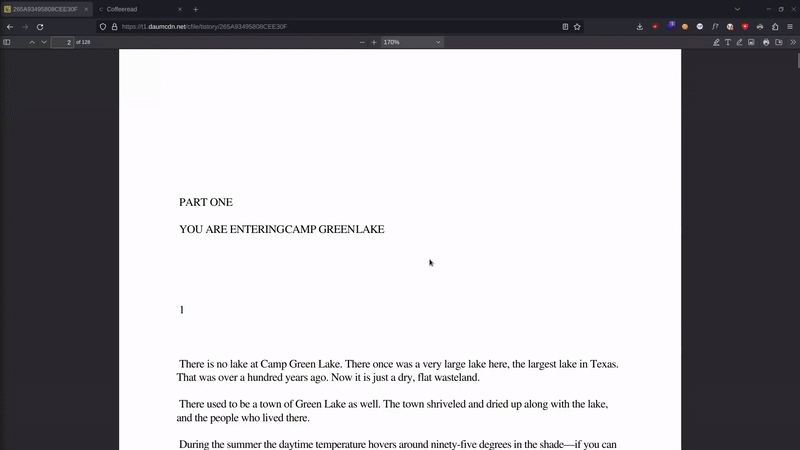

# MadMove

### 🇪🇸
Coffeeread es una aplicación web creada para mejorar la experiencia de lectura de documentos. Es tan fácil como copiar el texto del documento y pegarlo en la aplicación para comenzar a leer más comodamente. La app ha sido diseñada para proporcionar una interfaz limpia, sencilla e intuitiva, con los botones y textos justos. Además, cuenta con soporte para personas con dislexia, facilitando también su lectura.

### 🇺🇸
Coffeeread is a web application created to enhance the reading experience of documents. It’s as easy as copying the document text and pasting it into the app to start reading more comfortably. The app has been designed to provide a clean, simple, and intuitive interface, with just the right amount of buttons and text. Additionally, it includes support for people with dyslexia, making reading easier for them as well.

## Try it!

https://coffeeread.vercel.app/

## Demo

## Features

### 🇪🇸
- 💯&nbsp;Gratis & open-source.
- ➡️&nbsp;Muévete por el texto con las flechas.
- 🔍&nbsp;Busca palabras del texto.
- 🌓&nbsp;Tema oscuro.
- 🔤&nbsp;Tipografía para personas con dislexia.
- ⏭️&nbsp;Salta a la línea o página que prefieras.
- 💾&nbsp;Guarda automáticamente el texto en tu navegador.

### 🇺🇸
- 💯&nbsp;Free & open-source.
- ➡️&nbsp;Navigate through the text with arrows.
- 🔍&nbsp;Search for words in the text.
- 🌓&nbsp;Dark mode.
- 🔤&nbsp;Font for people with dyslexia.
- ⏭️&nbsp;Jump to the line or page you prefer.
- 💾&nbsp;Automatically saves the text in your browser.
